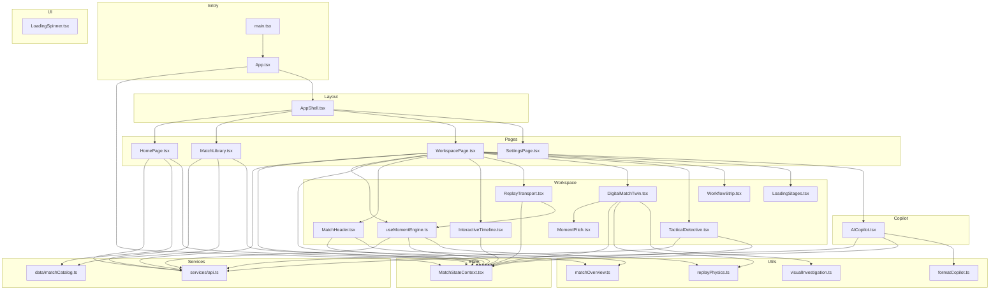
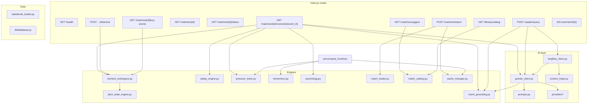

# PressureLab AI — Active Module Dependency Graph

Production surface after cleanup. Arrows show import/call direction (consumer → provider).

## Frontend (26 source files)



### Frontend API calls (only these endpoints)

| Client method | HTTP |
|---|---|
| `matchApi.health` | `GET /api/health` |
| `matchApi.suggest` | `GET /api/matches/suggest` |
| `matchApi.importMatch` | `POST /api/matches/import` |
| `matchApi.getMatch` | `GET /api/matches/{id}` |
| `matchApi.getStatus` | `GET /api/matches/{id}/status` |
| `matchApi.getKeyEvents` | `GET /api/matches/{id}/key-events` |
| `matchApi.getMoment` | `GET /api/matches/{id}/moments/{event_id}` |
| `matchApi.detectiveChoice` | `POST /api/matches/{id}/moments/{event_id}/detective` |
| `matchApi.libraryCatalog` | `GET /api/library/catalog` |
| `copilotApi.ask` | `POST /api/explain/query` |
| WebSocket (HomePage) | `WS /ws/match/{id}` |

---

## Backend (active production path)



### Backend modules retained but not on HTTP surface

These support moment analysis or optional Granite enrichment:

- `engine/replay_engine.py` — player decision context inside moment payload
- `engine/psychology.py` — composure/pressure traits for replay context
- `engine/pitch_state_engine.py` — coordinate coverage for pitch frames
- `ai/context_forge.py`, `ai/langflow_client.py`, `ai/docling_processor.py` — optional copilot pipeline
- `ai/providers/huggingface.py`, `ai/providers/watsonx.py` — LLM backends

### Removed from production path

| Category | Removed |
|---|---|
| Frontend components | `PressureTimeline`, `MomentumChart`, `FootballPitch`, `TraitRadarChart`, unused UI kit, `types/index.ts`, `probability.ts` |
| Frontend deps | `d3`, `@types/d3`, `react-router-dom` |
| Backend routes | search, overview, events list, upload/paste, twin, load-demo, live status, match-story, timeline-context, pressure/momentum GET, explain/event, replay/mind, prediction*, psychology*, simulate |
| Backend engines | `coach_simulator.py`, counterfactual methods in `moment_workspace.py` |
| AI prompts | `REPLAY_MIND`, `PREDICTION_EXPLANATION`, `COACH_SIMULATOR`, `PSYCHOLOGY` |
| Other | `backend/test.py`, `backend/models/schemas.py`, placeholder SVG assets |

---

## Data flow (one moment)

```
User selects event on timeline
  → useMomentEngine.syncMoment()
  → GET /moments/{event_id}
      → pressure_index + momentum caches
      → replay_engine (player context)
      → moment_workspace (pitch, why, detective, coach recs)
      → event_grounding + granite_client (bullets)
  → Workspace renders pitch replay + Tactical Detective + Copilot
```
